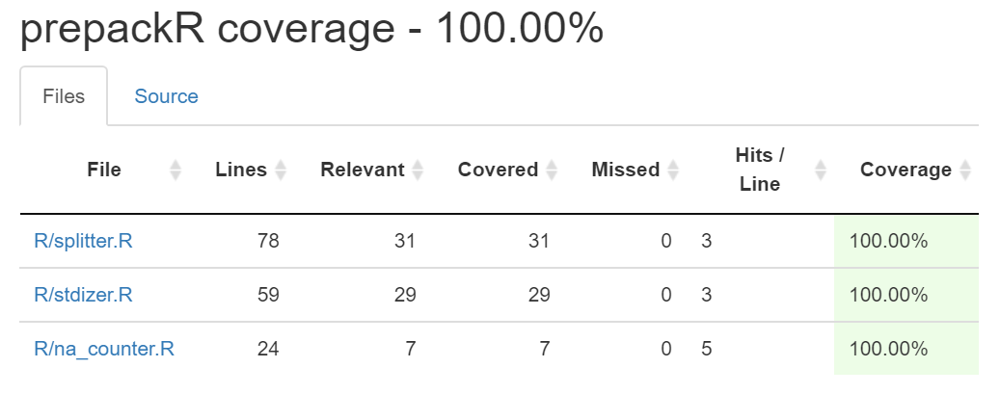

# prepackR

## Team
1. Jingyun Chen: [jchen9314](https://github.com/jchen9314)
2. Anthony Chiodo: [apchiodo](https://github.com/apchiodo)
3. Sarah Watts: [smwatts](https://github.com/smwatts)

## Topic

A common rule of thumb for data scientist is that the data preparation process will take approximately 80% of the total time on a project. Not only is this process time consuming, but it is also considered one of the less enjoyable components of a project ([Forbes, 2016](https://www.forbes.com/sites/gilpress/2016/03/23/data-preparation-most-time-consuming-least-enjoyable-data-science-task-survey-says/#3d12fbbf6f63)). To help address this problem, we have decided to build a package that will help improve some of the common techniques used in data preparation. This includes a function that will streamline the process of splitting a dataset into testing and training data (and provide a model ready output!), a function that incorporates more standardization methods then a data scientist could ever want _and_ a function that will allow data scientist to quickly understand the columns and quantity with `NA` values in a dataset.

## Install

`devtools::install_github("https://github.com/UBC-MDS/prepackR.git")`

## Example Useage

`stdizer()`

```
df <- tibble::tibble(feat1 = c(1:100), feat2 = runif(100, min = 0, max = 5000))
df_stdized <- stdizer(X = df, col_index = c(1, 2), method = 'mean_sd')
```

`splitter()`

```
df <- tibble::tibble(X = c(1:10), y = rbinom(10, 1, 0.5))
split_data <- splitter(df, target_index, split_size = 0.8, seed=42)
```

`na_counter()`

```
df <- tibble::tibble(feat1 = c(1:3, NA, 5:7, NA, NA, NA))
na_counter(X=df, col_index = c("feat1"))

```

## Test coverage



## Function Descriptions

### `splitter(X, target_column, split_size, seed)`

**Description:** create a function that operates in a similar manner to scikit-learns implementation of `train_test_split`.  Accepts a `tbl_df`, `df`, or `data.frame` as input.  Returns `tbl_df` as output for each train and each test set.

| Input Parameters | Input Type             | Output Parameters | Output Type    |
|------------------|------------------------|-------------------|----------------|
| X                | tbl_df,data.frame,tbl  | y train           | 1D tbl_df      |
| target_index    | numeric        | y test            | 1D tbl_df      |
| split_size       | numeric                | X train           | tbl_df         |
| seed             | numeric                | X test            | tbl_df         |

### `stdizer(X, col_index=None, method, method_args)`

**Description:** standardize features. Accepts `tbl_df`, `tbl`, or `data.frame` as input.  Returns `tbl_df` as output.

| Input Parameters | Input Type              | Output Parameters    | Output Type |
|------------------|-------------------------|----------------------|-------------|
| X                | tbl_df, data.frame, tbl | X_standardized       | tbl_df      |
| col_index        | vector of indices       |                      |             |
| method           | string                  |                      |             |
| method_args      | named vector            |                      |             |

### `na_counter(X)`

**Description:** summarise the missing data (`NA` values) in a dataset.  Accepts `tbl_df`, `tbl`, or `data.frame` as input.  Returns tidy `tbl_df` with a column for `NA` count and `NA` proportion.

| Input Parameters | Input Type             | Output Parameters  | Output Type |
|------------------|------------------------|--------------------|-------------|
| X                | tbl_df,data.frame,tbl  | X_na_counter       | tbl_df      |

## Relationship to the R ecosystem

### `splitter`

This function does not currently exist in R. However, the function [sample](https://www.rdocumentation.org/packages/base/versions/3.5.2/topics/sample) from the [base R](https://www.rdocumentation.org/packages/base/versions/3.5.2) package will be relevant. Specifically, it returns a random subset of an input vector based on a specified size. In order apply a random split to the training/testing data based on a specified percentage, we will need to leverage this function.

### `stdizer`

The function [scale](https://www.rdocumentation.org/packages/base/versions/3.5.2/topics/scale) exists in the [base R](https://www.rdocumentation.org/packages/base/versions/3.5.2) package. It allows you to standardize by:
1. Subtracting mean and dividing by standard deviation
2. Subtracting mean
3. Dividing by standard deviation

However, this function is not a one-stop shop to scale by:
1. Subtracting a first value, then dividing by second (a user specified mean and standard deviation)
2. Making a range from a start to end value (to linearly transform the data from a user specified minimum to maximum)

As a result, this function will allow users more options for their method of standardization.

These standardization techniques are based on the [Minitab documentation](https://support.minitab.com/en-us/minitab/18/help-and-how-to/calculations-data-generation-and-matrices/standardize/standardize-columns-of-data/).

### `na_counter`

This function does not currently exist in R. However, the function [is.na()](https://www.rdocumentation.org/packages/base/versions/3.5.2/topics/NA) from the [base R](https://www.rdocumentation.org/packages/base/versions/3.5.2) package is relevant because it allows users to identify `NA` values. Specifically, it returns a logical vector of the same length as the argument `x`, where the vector will contain TRUE for `NA` elements and FALSE otherwise. To count the number of `NA` values in each column, we will need to leverage this existing function.
